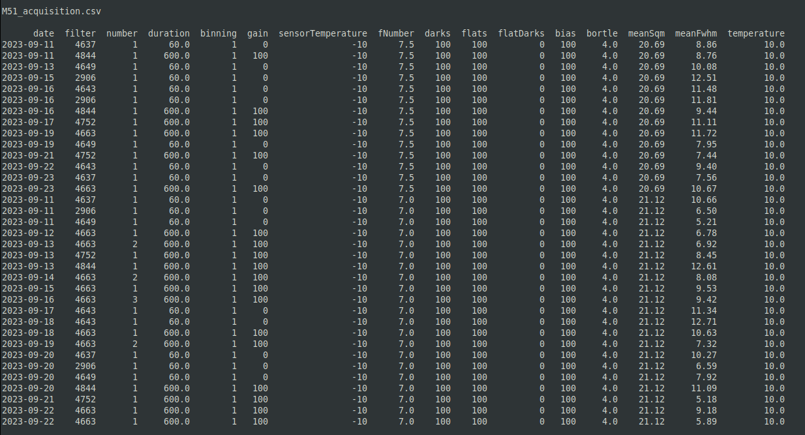

## **Contents**

- [Features](#features)   
- [Prerequisites](#prerequisites)    
    - [Installation of the AstroBinUpload.py script](#installation-of-the-astrobinuploadpy-script)
    - [config.ini generation](#configini-generation)
    - [config.ini contents and editing](#configini-contents-and-editing)
        - [[defaults]](#defaults)
        - [[filters]](#filters)
        - [[secrets]](#secrets)
        - [[sites]](#sites)
        - [Editing the initial config.ini](#editing-the-initial-configini)
- [Running the Script](#running-the-script)
    - [Initialization](#initialization-no-arguments-are-passed)
    - [Single directory or symbolic link passed to script](#a-single-directory-path-or-symbolic-link-argument-is-passed-to-the-script)
    - [Multiple directory paths or symbolic links are passed to the script](#multiple-directory-paths-or-symbolic-links-are-passed-to-the-script)
    - [Debug output](#debug-output)
- [Example calls and outputs](#example-calls-and-outputs)
    - [Single site, non-mosaic, no Masters. Data resides in structured single directory, symbolic links used for calibration data ](#example-1-single-site-non-mosaic-no-masters-data-resides-in-structured-single-directory-symbolic-links-used-for-calibration-data)
    - [Single site, 2 panel mosaic, symbolic links to calibration data, use of MASTERFLATS](#example-2-single-site-2-panel-mosaic-symbolic-links-to-calibration-data-use-of-masterflats)
    - [Dual site, structured directory, 2 panel mosaic, use of MASTERCALS](#example-3-dual-site-structured-directory-2-panel-mosaic-use-of-mastercals)
    - [WBPP two-panel mosaic](#example-4-wbpp-two-panel-mosaic)
- [References](#references)   
    - [AstroBin's Acquisition CSV File Format](#astrobins-acquisition-csv-file-format)
        - [AstroBin's Long Exposure Acquisition Fields](#astrobin-long-exposure-acquisition-fields)
    - [Astrobin Filter-Code mappings](#astrobin-filter-code-mappings)
        - [Finding the AstroBin's Numeric ID for Filters](#finding-astrobins-numeric-id-for-filters)
    - [Accessing sky quality data](#accessing-sky-quality-data)
    - [Reverse Geocoding](#reverse-geocoding)
    - [FWHM values](#fwhm-values)
    - [Data Sources](#data-sources )
- [Contributing to AstroBinUpload.py Processing Script](#contributing-to-astrobinuploadpy-processing-script)
- [Contact](#contact)
- [Licence](#licence)

<div style="page-break-after: always;"></div>

## **Features**

When run this Python script creates a detailed observation session summary and an acquisition.csv file suitable for upload using AstroBin's import CSV dialogue. 

Data is obtained by extracting FITS (Flexible Image Transport System) or XISF (Extensible Image Serialization Format) headers from image and calibration files associated with the given astronomical target.

Key features include:

- **The ability to pass multiple directories via the command line**: Multiple directories can be passed to the script via the command line. All images results contained within the directories will be accumulated as part of the target.  

- **Structured and unstructured directories**: Image files, including calibration files, can be collected into a single directory, the root directory. The root directory structure can be flat or contain subdirectories. 

- **Symbolic links to directories**: Symbolic links can be used within the root directory or passed directly via the command line, this is useful when reusing calibration directories. The first directory passed should be the root directory.     

- **MASTER calibration files**: If MASTER calibration files are found, these will be used. If the non-MASTER versions of the MASTER files are also found, the non-MASTER versions will be ignored. 

- **Processing of PixInsight's Weighted Batch Pre-processing (WBPP) output**: When the target is a WBPP directory the script will use the calibrated LIGHT frames as well as any MASTER calibration files found in the directory. MASTERLIGHT or processed image files are ignored. 

- **Multiple panel mosaic imaging sessions**: Mosaic imaging sessions are detected from the OBJECT entry in the FITS headers. LIGHT frames are processed on a per-panel basis, whilst calibration data is processed per target. For this to work correctly the image names (OBJECT in FITS header) must have the format  

        "target name Panel x"   

    where x is the panel number. N.I.N.A does this automatically but in Sequence Generator Pro the user will have to edit the directory name in Target Settings before starting the sequence.

- **Multiple site support**: Multi-site collaborative target acquisition or remote observatory image capture is supported. Site location data is reverse-geocoded from HEADER location data. Data from multiple sites is reported with summary outputs that correctly identify the site contribution, for instance equipment, LIGHT, and calibration data. All data is, however, aggregated in the AstroBin.csv file for the image target.

- **Support for multiple file formats**: Extracts headers for all FITS/FIT/FTS/XISF files in specified directories. Directories can have a mix of files. 

- **Accepts files generated by N.I.N.A, SGPro, ACP, MaximDL and PixInsight** 

- **Sky Quality Retrieval**: Recovers SQM and Bortle scale classification based on the observation location coordinates. 

- **Auxiliary Parameter Calculation**: Calculates additional parameters like Image Scale (IMSCALE), and Full-width Half Maximum (FWHM) from measured/estimated HFR values for each image. 

- **AstroBin Compatibility**: Formats aggregated data for upload to AstroBin's import CSV file dialogue.

- **Target summary**: Creates a detailed summary text file for a target acquisition session. Caters for single or multi-site data as well as single or mosaic imaging data.

- **Summary files stored in the working directory**: Creates a folder called AstroBinUploadInfo in the current image working directory. Files saved are:

    - ***AstroBinUploader.log***: log file for current session

    - ***acqusition.csv***: session summary in the correct format to copy and paste to AstroBin's import CSV dialogue.

    - ***session_summary.txt***: copy of the detailed session summary that is output to the screen by the script

    - ***Debug files***: Files created when the --debug switch is used


## **Pre-requisites**

Before using this script, ensure you have Python 3.x installed. [Python Installation Instructions](https://python.land/installing-python).   

### **Installation of the AstroBinUpload.py script**

To install this script, follow these steps:

1. Create a directory to hold the script and associated files

2. Clone or download the repository from my [GitHub repository](https://github.com/SteveGreaves/AstroBinUploader)

3. Ensure the following files are in the new directory:
    - AstroBinUpload.py
    - utils.py
    - requirements.txt

4. To install the required python libraries, navigate to the new directory and run the following command:   

    `pip install -r requirements.txt`

### **Initialization and Config.ini generation**
The script is first run with no arguments. This will create a default config.ini file in the local directory. The config.ini file defines parameters the script needs to run correctly. This file can be personalized by the user. A description of the config.ini file parameters is given later. Then you run the script for the first time or if your config.ini file has been deleted, you will see the following:

        'A new config.ini file was created. Please edit this before re-running the script:' 

The script will halt, allowing you to edit the config.ini file using a text editor. You can then the re-run the script. 

If you run the script when the config.ini file exists and pass no arguments, an error will be flagged, and the script will exit.

### **Config.ini contents and editing**
The config.ini file contains the following sections:
### **[defaults]**

The [defaults] section holds: 
1. Default FITS keywords that should be present in the header files and that are needed in the production of the astrobin.csv output file
2. Default site location and auxiliary information, used in the production of the summary.txt output file

The data in the [defaults] section can be modified by the user. If the script cannot find the information in the header files it will take it from the [defaults] section of the config.ini file

### **[filters]**
The filter section holds the filter name to AstroBin code mappings. The filter names and codes can be modified here.

### **[secrets]**
The secret section holds:
1. The sky quality API keys and API endpoint required by the script to b able to obtain values of Bortle and SQM for the site location. Only the API key is to be edited. If there is no valid API key the values of Bortle and SQM are taken from [defaults][BORTLE] and [defaults][SQM] in the config.ini file

2. User email address. This is used as part of an information string sent to the reverse geocoding API, which is used to recover the site address. Unique site latitude and longitude values extracted from the headers are passed to the API to generate the site address. Your email address is passed to the API as courtesy, so the provider can see who is using their API. If the API request fails the site location information is taken from [defaults][SITE], [defaults][SITELAT] and [defaults][SITELONG] in the config.ini file.

### **[sites]**
The [sites] section holds historic site information found by the script. When a script is run it first looks here to collect site information. Only if a site found in the headers does not exist does it access the external API's. The script automatically updates this section if a new site is found. The user does not usually have to edit this section, but remote site information can be added here if the script cannot access the API.

It is advisable to back up you config.ini file regularly. 


<div style="page-break-after: always;"></div>

## **Editing the config.ini**
A config.ini file with an explanation of the sections is given below:

```
[defaults]
        IMAGETYP = LIGHT
        EXPOSURE = 0.0
        DATE-OBS = 2023-01-01
        XBINNING = 1
```
These are place-holders and are fall backs. These parameters should be created by the capture software.

```
        GAIN = -1
        EGAIN = -1
```
If you have a CCD camera, leave these values as they are. If you have a CMOS camera these gain values can be set to the typical values of your camera. The script will, however, collect the correct results for both CCD and CMOS cameras from the headers processed. 
```
        INSTRUME = None
        TELESCOP = None
        FOCNAME = None
        FWHEEL = None
        ROTATOR = None
        XPIXSZ = 1
        CCD-TEMP = -10
        FOCALLEN = 540
        FOCRATIO = 5.4
```
This is where default the equipment configuration. Again the script should be able to populate these parameters from the header information. XPIXSZ is the X-pixel size in um and is used to represent the sensor pixel size in the script.
```
        SITE = Papworth Everard
        SITELAT = 52.2484
        SITELONG = -0.1231
        BORTLE = 4
        SQM = 20.5
```
You should modify these parameters to reflect your own site. If any API call fails the script will fall back to these parameters

<div style="page-break-after: always;"></div>

```
        FILTER = No Filter
```
If you use a color camera and don't report your filters automatically you should enter your filter name here as there may be no filter information in the header.
```
        OBJECT = No target
        FOCTEMP = 20
```
These are place-holders and should not be required as they should be populated by the capture software

```
        HFR = 1.6
```
You should set this value to the typical value for your imaging train. If you use N.I.N.A you can add the measured HFR for the image to the file name. The script looks for HFR=X.XX in the image file name and if present uses the value found, if HFR is not in the image file name the script falls back to this value.
```
        SWCREATE = Unknown package
```
This is a place-holder and should not be required, it should be created by the capture software
```
[filters]
        #Filter     code
        Ha        = 4663
        SII       = 4844
        OIII      = 4752
        Red       = 4649
        Green     = 4643
        Blue      = 4637
        Lum       = 2906

```
Modify the [filters] section to reflect your imaging set up, see [Astrobin Filter-Code mappings](#astrobin-filter-code-mappings) for information on how to populate this table. If you use a color camera and don't report your filters automatically you should enter your filter name and the corresponding code here. Delete filters you don't require.

<div style="page-break-after: always;"></div>


```
[secret]
        #API key        API endpoint
        xxxxxxxxxxxxx = https://www.lightpollutionmap.info/QueryRaster/
        EMAIL_ADDRESS = id@provider.com
```
If you wish to automatically generate an address and sky quality information for the observation site enter the [Sky Quality API key](#accessing-sky-quality-data) and your [email address](#reverse-geocoding) here. If you don't wish to do this or if the API calls fail the script falls back to site parameters found in the [defaults] section 
```
[sites]
```
If the script is run and a new site identified the script will update the [sites] section with the new site information. For example after one run my home location was added to the [sites] as shown below:

```
[sites]
        [["Norton Close, Papworth Everard, South Cambridgeshire, Cambridgeshire, Cambridgeshire and Peterborough, England, CB23 3XT, United Kingdom"]]
                latitude = 52.2484
                longitude = -0.1231
                bortle = 4
                sqm = 20.52
```
When the script processes [SITELAT] and [SITELONG] header entries it looks here first to see if a site has been seen before. If it has the script uses the site information found, if not it calls the external APIs to retrieve the information. If the external API call fails the script falls back to site parameters found in the [defaults] section of the configs.ini file. New sites can also be manually added in the [sites] section following the format shown above.

## **Running the Script**

The script is called from the command line. There are three calling methods:

### **Initialization, no arguments are passed**:  

    Linux/MACOS example: python3 AstroBinUpload.py 
    Windows example:     python  AstroBinUpload.py 

When called with no argument the script will create a new default config.ini file in the local directory and then exit. The user can then edit the config.ini file, using a text editor, before running the script again. If an existing config.ini file is lost and the script run, a new default config.ini file will be created, and the code will exit. Once you have personalized your config.ini file make a backup.

### **A single directory path or symbolic link argument is passed to the script**

 Note: only Linux calling examples are used going forward.

    python3 AstroBinUpload.py "dir 1" 

The script expects to find all data contained in the directory passed to it. Symbolic links can be used as the argument passed to script and can also be present in the directory. The directory leaf or child directory name must be the target name if the output files are to be named correctly. From the processing perspective the only condition required to ensure data is associated with a given target is that all data and links must reside in the one directory.

### **Multiple directory paths or symbolic links are passed to the script** 

    python3 AstroBinUpload.py "dir 1" "dir 2" .... 

All directory arguments are assumed to belong to one target. Again the first directory leaf, or child directory name should contain the target name for the output files to be named correctly.

### **Debug output**

    python3 AstroBinUpload.py "dir 1" "dir 2" ... --debug

This will dump four processed header files to the AstroBinUploadInfo directory  as .csv files. The files are

    Target_name_basic_headers.csv
    Target_name_headers.csv
    Target_name_modified.csv
    Target_name_aggregated.csv

These files can be used to assist the debugging of any issues

<div style="page-break-after: always;"></div>

# **Example calls and outputs**

## **Example 1: Single site, non-mosaic, no Masters, data resides in structured single directory, symbolic links used for calibration data** 


### Example 1: Directory structure

    python3 AstroBinUpload.py "/mnt/HDD_8TB/Preselected/Sadr Region"


### Example 1: Script calling syntax

The output files being named:     
- Sadr_Region_session_summary.txt
- Sadr_Region_aquisition.csv  


<div style="page-break-after: always;"></div>


### Example 1: Summary output

<div style="page-break-after: always;"></div>


### Example 1: AstroBin.csv output


## Example 2: Single site, 2 panel mosaic, symbolic links to calibration data, use of MASTERFLATS


### Example 2: Directory structure

    python3 AstroBinUpload.py '/mnt/HDD_8TB/Preselected/NGC 1499 Mosaic'
    
    or using a symbolic link:
    
    python3 AstroBinUpload.py '/home/steve/Desktop/AstroData/Link to NGC 1499 Mosaic'

### Example 2: Script calling syntax

<div style="page-break-after: always;"></div>


### Example 2: Summary Output

<div style="page-break-after: always;"></div>


### Example 2: AstroBin.csv output

## Example 3: Dual site, structured directory, 2 panel mosaic, use of MASTERCALS

Note: although data is reported on a per-site basis, data is aggregated from all sites to create the AstroBin.csv output. Symbolic links can also be used. A non-structured directory can also be used as long as all files reside under the main target directory. Mosaics can be generated per site, however, summary files can be quite large.


### Example 3: Directory structure


### Example 3: Script calling syntax

    python3 AstroBinUpload.py "/mnt/HDD_8TB/AstroBinTest/M51"

<div style="page-break-after: always;"></div>

### Example 3: Summary Output

### Site 1


<div style="page-break-after: always;"></div>

### Site 2


<div style="page-break-after: always;"></div>



### Example 3: AstroBin.csv output

## **Example 4: WBPP two-panel mosaic**


### Example 4: Directory structure

    python3 AstroBinUpload.py "/home/steve/Desktop/Current PixInsight Projects/California Nebula (NGC1499)"

### Example 4: Script calling syntax

<div style="page-break-after: always;"></div>    


### Example 4: Summary Output

<div style="page-break-after: always;"></div>


### Example 4: AstroBin.csv output

<div style="page-break-after: always;"></div>

# **References**

## **AstroBin's Acquisition CSV File Format**

This section details the required data fields for AstroBin's `acquisition.csv` dialogue.

### **AstroBin Long Exposure Acquisition Fields**

| **Field**        | Description | Validation |
|------------------|-------------|------------|
| **date**         | The date when the acquisition took place | YYYY-MM-DD format |
| **filter**       | Filter used | Numeric ID of a valid filter (found in the URL of the filter's page in the equipment database) |
| **number***      | Number of frames | Whole number |
| **duration***    | Duration of each frame in seconds | Number, Max decimals: 4, Min value: 0.0001, Max value: 999999.9999 |
| **iso**          | ISO setting on the camera | Whole number |
| **binning**      | Binning of pixels | One of [1, 2, 3, 4] |
| **gain**         | Gain setting on the camera | Number, Max decimals: 2 |
| **sensorCooling**| The temperature of the chip in Celsius degrees, e.g., -20 | Whole number, Min value: -274, Max value: 100 |
| **fNumber**      | If a camera lens was used, specify the f-number used for this acquisition session | Number, Max decimals: 2, Min value: 0 |
| **darks**        | The number of dark frames | Whole number, Min value: 0 |
| **flats**        | The number of flat frames | Whole number, Min value: 0 |
| **flatDarks**    | The number of flat dark frames | Whole number, Min value: 0 |
| **bias**         | The number of bias/offset frames | Whole number, Min value: 0 |
| **bortle**       | Bortle dark-sky scale | Whole number, Min value: 1, Max value: 9 |
| **meanSqm**      | Mean SQM mag/arcsec^2 as measured by a Sky Quality Meter | Number, Max decimals: 2, Min value: 0 |
| **meanFwhm**     | Mean Full Width at Half Maximum in arc seconds, a measure of seeing | Number, Max decimals: 2, Min value: 0 |
| **temperature**  | Ambient temperature in Celsius degrees | Number, Max decimals: 2, Min value: -88, Max value: 58 |

## **Astrobin Filter-Code mappings**

The [filters] section of the config.ini file defines the mapping from the filter name to AstroBin's filter code.

The contents of my [filters] section is given below. It shows the names my Astronomik 2 inch filters, as generated by N.I.N.A, and their corresponding AstroBin codes:

[filters]

| **Filter** | **Code** |
|------------|----------|
| Ha         | 4663     |
| SII        | 4844     |
| OIII       | 4752     |
| Red        | 4649     |
| Green      | 4643     |
| Blue       | 4637     |
| Lum        | 2906     |
| CLS        | 4061     |

This is the default filter table in the config.ini. You should this section so that it reflects the filters you use. The filter names should match the names the image capture software generates for your filters.

### **Finding AstroBin's Numeric ID for Filters**

The numeric ID of a filter can be found by examining the URL of the filter's page in the [AstroBin equipment database](https://app.astrobin.com/equipment/explorer/filter?page=1).   

For example, consider a [2-inch H-alpha CCD 6nm filter from Astronomik](https://app.astrobin.com/equipment/explorer/filter/4663/astronomik-h-alpha-ccd-6nm-2). By using [AstroBin's filter explorer](https://app.astrobin.com/equipment/explorer/filter?page=1) to navigate to this filter's page the URL is found to be :

https://app.astrobin.com/equipment/explorer/filter/4663/astronomik-h-alpha-ccd-6nm-2

From this URL, the AstroBin code for this Astronomik 2-inch H-alpha CCD 6nm filter is 4663.

## **Accessing sky quality data** 

The artificial_brightness of the sky at a given latitude and longitude is obtained from the excellent web resource https://www.lightpollutionmap.info. This can be by done by visiting the website and entering the latitude and longitude of the observation site and obtaining the parameters Bortle and SQM. These parameters can then be entered into the [defaults] section of the cofig.ini file. It can also be done programmatically by the code. To do this you need to place an API_KEY and API_ENDPOINT for the service in the secret.csv file. The only API_ENDPOINT supported currently is https://www.lightpollutionmap.info/QueryRaster/. You will have to apply to Jurij Stare, the website owner, for an API key. Jurij's email address is starej@t-2.net. The approach I suggest is: donate a small amount in support of his website. He will send you a thank you e-mail and in response ask for an API key.

[secrets] section format relating to the sky quality API is shown below:

| **API Key** | **API Endpoint**|
| ----------- | --------------- | 
| **************** | https://www.lightpollutionmap.info/QueryRaster/ |

## **Reverse Geocoding**
The script process the latitude and longitudes found in the header files and uses the [Geopy Nomintim library](https://geopy.readthedocs.io/en/stable/#nominatim), which in turn, uses the [Open Street Map](https://www.openstreetmap.org/about) API. As a courtesy the script provides the email address of the user accessing the API. To enable this the [secrets][EMAIL_ADDRESS] is used and should be set to your email address. Reverse geocoding is required to be able to produce accurate summary information with multi-site data. Without it all data is aggregated under the default site. It does not affect the Astrobin.csv output as this is aggregated across sites for any target.

[secrets] section format relating reverse geocoding API is shown below:

| **API Key** | **API Endpoint**|
| ----------- | --------------- | 
| EMAIL_ADDRESS | id@provider.com |

Set the EMAIL_ADDRESS to your email. If the API call fails then the [default] site information is used 

## **FWHM Values**

The AstroBin Long Exposure Acquisition Fields has an entry for meanFwhm. This is not directly available from the header file. But N.I.N.A allows for the mean HFR value of an image to be embedded in the image file name. An example of my file naming convention, with HFR embedded, is given below:

'NGC 7822_Panel_1_Date_2023-09-02_Time_21-09-01_Filter_Ha_Exposure_600.00s_HFR_1.64px_FrameNo_0002.fits'

The code will look for the keyword HFR in the image file name. If found it will extract the HFR value and assign it to a variable HFR. As HFR is given in pixels, the script calculates the FWHM from the telescope information held in the FITS header. In particular XPIXSZ the x pixel size in microns and FOCALLEN the telescope focal length in mm.

IMSCALE = XPIXSZ / FOCALLEN * 206.265  
FWHM = 2 * hfr * imscale

The calculations above assume that all stars are circular making FWHM a scaled version of HFR. This is a reasonable approximation as the code averages HFR across all images taken on a particular date with a given filter and gain and then AstroBin further averages HFR across all entries in the uploaded CSV file. Where HFR is not available in the filename it is obtained from [defaults][HFR] in the config.ini file.

## **Data Sources** 
The script was developed to work with the following sources of image files

1. Night Time Imaging N' Astronomy ([N.I.N.A](https://nighttime-imaging.eu/))

2. Sequence Generator Pro ([SGPro](https://www.sequencegeneratorpro.com/sgpro/))

3. [PixInsight](https://pixinsight.com/) for Master calibration frames

FIT, FITS and FTS file headers are accessed in the code using [Astropy's FITS header library](https://docs.astropy.org/en/stable/io/fits/index.html).
To access XISF headers functions were developed based upon the [Pixinsight XISF header specification](https://pixinsight.com/doc/docs/XISF-1.0-spec/XISF-1.0-spec.html#xisf_header).


## **Contributing to AstroBinUpload.py Processing Script**

This script is intended for educational purposes in the field of astrophotography. It is part of an open-source project and contributions or suggestions for improvements are welcome.

To contribute to this project, follow these steps:

1. Fork this repository.
2. Create a branch: `git checkout -b <branch_name>`.
3. Make your changes and commit them: `git commit -m '<commit_message>'`.
4. Push to the original branch: `git push origin <project_name>/<location>`.
5. Create the pull request.

Alternatively, see the GitHub documentation on [creating a pull request](https://docs.github.com/en/github/collaborating-with-issues-and-pull-requests/creating-a-pull-request).

## **Contact**

If you want to contact me, you can reach me at sgreaves139@gmail.com.

## **License**

This project uses the following licence: [GNU General Public Licence v3.0](https://github.com/SteveGreaves/AstroBinUploader/blob/main/LICENSE).


